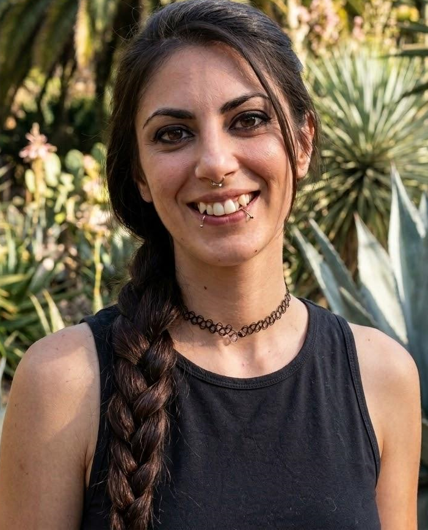

# Programación con objetos I
## Presentación Personal

### Datos Personales
- Mi nombre es: Florencia Retamozo
- Vivo en Hurlingham
Estoy cursando mi segundo año de la carrera de programacion.
Trabajo en en un estudio contable como administrativa y liquidadora de impuestos. Decidi estudiar esta carrera porque me gusta y ademas para sumar herramientas para mi trabajo, como por ejemplo la automatizacion de tareas.

### Otra Información
- Este es mi primer contacto con github, me parece una herramienta interesante. La idea es meterle ganas, agarrarle bien la mano  a la materia y aprender a resolver problemas.

- En mis tiempos libres me gusta ir a recitales, y estar en casa con la compañia de mis perritos, Felipe II, Canela, y Otto y mi gata Luna de Totoro
